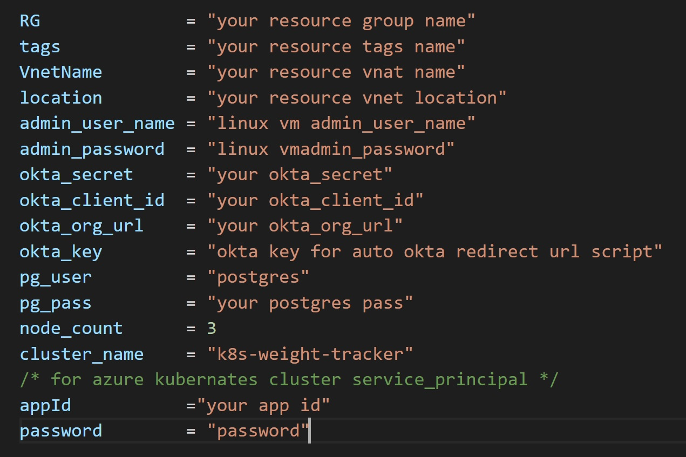

# Description

This is an infrastructure repo of an aks cluster and a linux virtual machine to be an agent for a ci/cd pipeline.

---

## Notes

As part of a DevOps bootcamp is sela accademy [Sela DevOps Bootcamp Page](https://rhinops.io/bootcamp).

This code implimants the following:

- Module folder that containes modules detailed below
   
- An azure kubernates cluster 
- An azure container regestery 

this repo is used indepandetly to deploy the Webapp with a ci-cd piipelin e from [bootcamp-app aks pipeline](https://dev.azure.com/oderafiBigspender/_git/BOOTCAMP-APP%20K8S).

---

## Deployment

First you need to install terraform and connect to azure provider as explained in
[Install Terraform - HashiCorp Learn](https://learn.hashicorp.com/tutorials/terraform/install-cli).

Inorder to run the template you will need to create a terraform.tfvar file to update your secret data.

Using git, clone the repository to your local machine.

_and run the foolowing commmand:_

- Initialize Terraform working directory

  terraform init

- To deploy the enviroment :

  > terraform plan 

  > terraform apply

- To destroy the enviroment:

  > terraform destroy

---
## Requirements

| Name | Version |
|------|---------|
|  [terraform](#requirement\_terraform) | >= 1.1.0 |
|  [azurerm](#requirement\_azurerm) | ~> 2.65 |

## Providers

| Name | Version |
|------|---------|
|  [azurerm](#provider\_azurerm) | 2.99.0 |

## Modules

| Name | Source | Version |
|------|--------|---------|
|  [Agent](#module\_Agent) | ./Modules/Linux_vm | n/a |
|  [RG](#module\_RG) | ./Modules/resource_group | n/a |
|  [Subnets](#module\_Subnets) | ./Modules/subnets | n/a |
|  [Vnet](#module\_Vnet) | ./Modules/virtual_net | n/a |
|  [azurerm\_storage\_blob](#module\_azurerm\_storage\_blob) | ./Modules/azurerm_storage_blob | n/a |

## Resources

| Name | Type |
|------|------|
| [azurerm_container_registry.acrforapp](https://registry.terraform.io/providers/hashicorp/azurerm/latest/docs/resources/container_registry) | resource |
| [azurerm_kubernetes_cluster.k8s](https://registry.terraform.io/providers/hashicorp/azurerm/latest/docs/resources/kubernetes_cluster) | resource |
| [azurerm_network_security_group.NSG1](https://registry.terraform.io/providers/hashicorp/azurerm/latest/docs/resources/network_security_group) | resource |
| [azurerm_subnet_network_security_group_association.NSG1](https://registry.terraform.io/providers/hashicorp/azurerm/latest/docs/resources/subnet_network_security_group_association) | resource |

## Inputs

| Name | Description | Type | Default | Required |
|------|-------------|------|---------|:--------:|
|  [RG](#input\_RG) | Reasource group name | `string` | `"RG"` | no |
|  [VnetName](#input\_VnetName) | virtual network name | `string` | `"Vnet"` | no |
|  [Vnet\_address\_space\_prefixes](#input\_Vnet\_address\_space\_prefixes) | n/a | `list(any)` | <pre>[   "10.30.0.0/16" ]</pre> | no |
|  [acr\_name](#input\_acr\_name) | n/a | `string` | `"acrforapp"` | no |
|  [admin\_password](#input\_admin\_password) | password for vm login | `string` | `"Input your password here"` | no |
|  [admin\_user\_name](#input\_admin\_user\_name) | user name for vm login | `string` | `"Input your user name"` | no |
|  [appId](#input\_appId) | Azure Kubernetes Service Cluster service principal | `string` | n/a | yes |
|  [cluster\_name](#input\_cluster\_name) | n/a | `string` | `"k8s-weight-tracker"` | no |
|  [kubernetes\_version](#input\_kubernetes\_version) | n/a | `string` | `"1.23.5"` | no |
|  [linux\_vm\_Ip\_name](#input\_linux\_vm\_Ip\_name) | Agent Controller Ip name | `string` | `"linux_vm_Ip"` | no |
|  [linux\_vm\_Name](#input\_linux\_vm\_Name) | virtual machine name | `string` | `"Agent"` | no |
|  [linux\_vm\_nic\_Name](#input\_linux\_vm\_nic\_Name) | Agent Controller nic name | `string` | `"linux_vm_nic"` | no |
|  [location](#input\_location) | Azure location of terraform server environment | `string` | `"East US"` | no |
|  [node\_count](#input\_node\_count) | n/a | `number` | `3` | no |
|  [okta\_client\_id](#input\_okta\_client\_id) | n/a | `string` | `""` | no |
|  [okta\_key](#input\_okta\_key) | n/a | `string` | `""` | no |
|  [okta\_org\_url](#input\_okta\_org\_url) | n/a | `string` | `""` | no |
|  [okta\_secret](#input\_okta\_secret) | n/a | `string` | `""` | no |
|  [password](#input\_password) | Azure Kubernetes Service Cluster password | `string` | n/a | yes |
|  [pg\_pass](#input\_pg\_pass) | n/a | `string` | `""` | no |
|  [pg\_user](#input\_pg\_user) | n/a | `string` | `"postgres"` | no |
|  [private\_address\_space](#input\_private\_address\_space) | n/a | `list(any)` | <pre>[   "10.30.2.0/24" ]</pre> | no |
|  [private\_subnet\_name](#input\_private\_subnet\_name) | n/a | `string` | `"Data_Tier"` | no |
|  [public\_address\_space](#input\_public\_address\_space) | n/a | `list(any)` | <pre>[   "10.30.1.0/24" ]</pre> | no |
|  [public\_subnet\_name](#input\_public\_subnet\_name) | n/a | `string` | `"Web_Tier"` | no |
|  [storage\_account\_Name](#input\_storage\_account\_Name) | n/a | `string` | `"odedstorage1"` | no |
|  [tags](#input\_tags) | n/a | `string` | `"enviroment"` | no |

## Outputs

No outputs.
